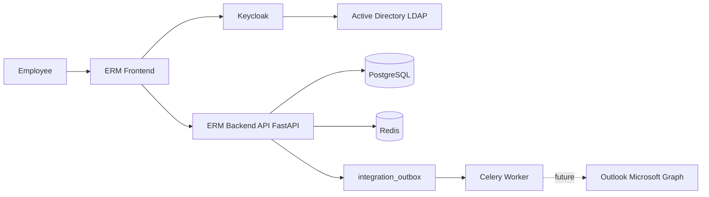
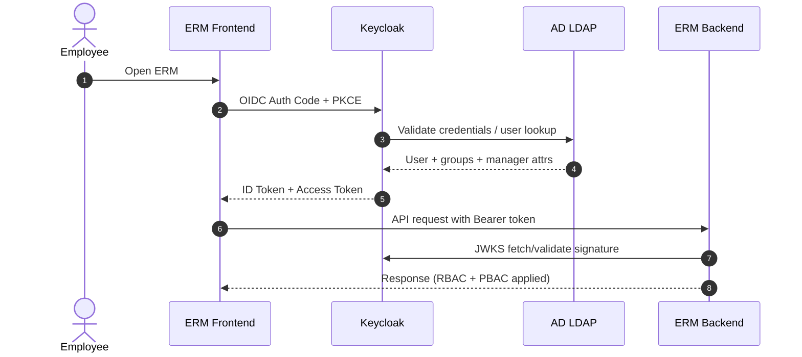
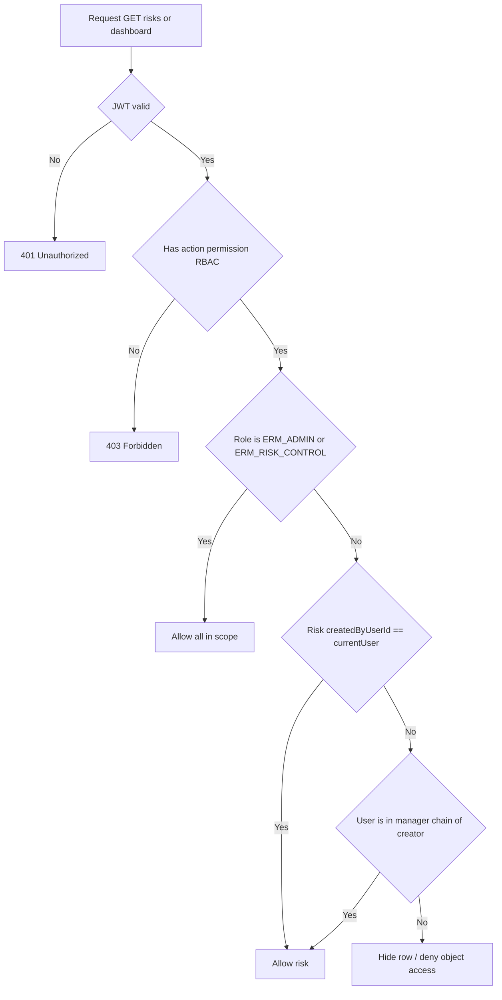
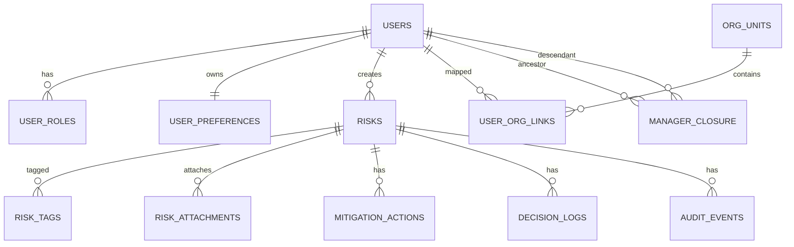
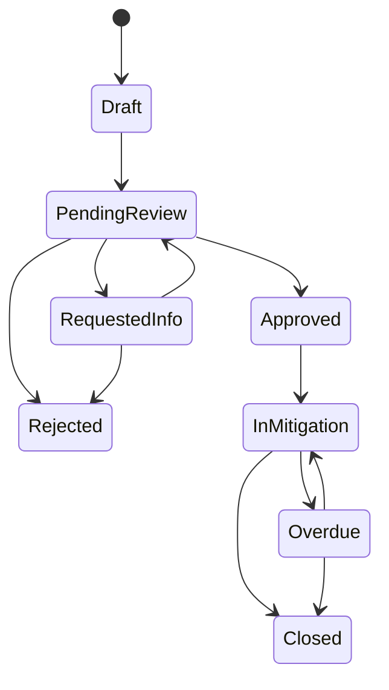
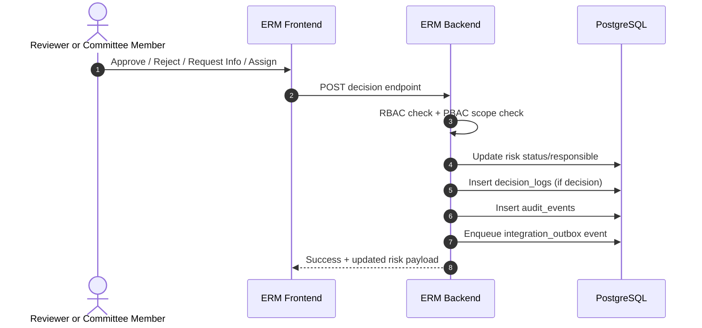

# ТЗ для Backend: ERM (Uzcard)

Версия: 1.4  
Дата: 17.02.2026  
Основание: текущий frontend в `src/` (React + Vite, локальное состояние в `ErmContext`)

## 1. Цель

Реализовать production-ready backend для ERM-системы, чтобы полностью заменить мок-данные и `localStorage` на API + БД + корпоративную авторизацию.

Ключевое архитектурное решение: использовать связку **LDAP AD -> Keycloak -> ERM API**.

## 2. Что уже есть на фронте (контракт, который нельзя ломать)

### 2.1 Экраны
- `/dashboard` — executive overview
- `/risks` — реестр рисков
- `/risks/:id` — карточка риска (overview/financial/mitigation/audit)
- `/queue` — очередь проверки (Pending Review + Requested Info)
- `/committee` — повестка + журнал решений
- `/create` — создание риска
- `/admin` — справочники/структура

### 2.2 Доменные значения (как в `src/data/seedMeta.js`)
- Categories: `Operational`, `IT`, `Compliance`, `Fraud`, `Vendor`, `Reputational`
- Departments: `Treasury`, `Retail Banking`, `Corporate Banking`, `IT & Security`, `Compliance`, `Operations`, `Human Resources`, `Procurement`
- Statuses:
  - `Draft`
  - `Pending Review`
  - `Requested Info`
  - `Approved`
  - `In Mitigation`
  - `Overdue`
  - `Closed`
  - `Rejected`
- Queue statuses: `Pending Review`, `Requested Info`

### 2.3 Формулы и правила (как в `src/lib/compute.js`)
- `expectedLoss = clamp(probability, 0.01..0.99) * impactMostLikely`
- Severity thresholds:
  - `Low`: `< 700,000,000`
  - `Medium`: `>= 700,000,000 and < 2,000,000,000`
  - `High`: `>= 2,000,000,000 and < 5,000,000,000`
  - `Critical`: `>= 5,000,000,000`
- `inherentScore = probabilityBand(1..5) * impactBand(1..5)`
- `residualScore`: если не задан, то `max(1, inherentScore - 3)`, иначе clamp `1..25`
- Поиск в реестре: `title`, `owner`, `responsible`, `tags[]`

## 3. IAM и SSO: целевая архитектура (обязательно)

## 3.1 Архитектура
`Active Directory (LDAP) -> Keycloak -> ERM Backend API -> ERM Frontend`

AD является источником идентичностей. ERM **не хранит пароли пользователей**.

## 3.2 Почему Keycloak
- Единая точка SSO для ERM и будущих систем
- LDAP Federation к AD
- Выдача OIDC/JWT токенов для SPA и API
- Централизованное управление ролями и маппинг AD-групп
- Готовая база для MFA, policy, session control

## 3.3 Настройки Keycloak (MVP)
- Realm: `uzcard-erm` (финальное имя согласовать с ИБ)
- Client `erm-frontend`:
  - тип: Public
  - flow: Authorization Code + PKCE
  - redirect URI: домены FE (dev/stage/prod)
- Client `erm-backend`:
  - тип: Bearer-only или Confidential (решить на архитектурной сессии)
- LDAP User Federation:
  - `Edit Mode = READ_ONLY` (рекомендовано)
  - Периодический sync пользователей и групп
  - Обязательные маппинги атрибутов: `username`, `displayName`, `email`, `department`, `title`, `employeeId`
- Group mapper:
  - AD security groups -> Keycloak groups/roles -> роли ERM

## 3.4 Маппинг AD-групп в роли ERM
Минимальный набор:
- `AD: UZCARD_ERM_ADMINS` -> `ERM_ADMIN`
- `AD: UZCARD_ERM_RISK_MANAGERS` -> `ERM_RISK_MANAGER`
- `AD: UZCARD_ERM_REVIEWERS` -> `ERM_REVIEWER`
- `AD: UZCARD_ERM_COMMITTEE` -> `ERM_COMMITTEE_MEMBER`
- `AD: UZCARD_ERM_VIEWERS` -> `ERM_VIEWER`
- `AD: UZCARD_ERM_RISK_CONTROL` -> `ERM_RISK_CONTROL`

Если пользователь в нескольких группах, применяется union прав.

## 3.5 Проверка токена на backend
На каждом защищенном endpoint:
- валидация подписи JWT через JWKS Keycloak
- проверка `iss`, `aud`, `exp`, `nbf`, `sub`
- извлечение ролей из `realm_access.roles` и/или `resource_access`
- формирование `UserContext` (`userId`, `displayName`, `email`, `department`, `roles`)
- загрузка орг-контекста (`managerExternalId`, `orgUnitId`, `orgPath`) для PBAC-проверок

Рекомендуется кешировать JWKS с безопасным TTL (например 5-10 минут).

## 3.6 Логаут и сессии
- FE выполняет logout через Keycloak endpoint
- Backend не хранит stateful-сессии пользователя (token-based)
- TTL и refresh-политики согласовать с ИБ

## 3.7 Модель доступа: RBAC + PBAC
В системе используется комбинированная авторизация:
- `RBAC` отвечает за **действия** (кто может approve/reject/edit/admin и т.д.)
- `PBAC` отвечает за **область видимости данных** (какие риски пользователь может видеть)

Обязательные PBAC-правила видимости риска:
- риск видит его создатель (`createdByUserId`)
- риск видит руководитель департамента, где работает создатель риска
- риск видят все вышестоящие руководители по цепочке над этим руководителем
- риск видят все сотрудники отдела контроля рисков
- `ERM_ADMIN` видит все риски

Рекомендуемый технический источник иерархии:
- AD атрибут `manager` + орг-структура подразделений (через LDAP/HR feed в Keycloak/локальный кэш)

## 4. RBAC (права)

Permissions:
- `VIEW_DASHBOARD`
- `VIEW_RISKS`
- `CREATE_RISK`
- `EDIT_RISK`
- `EDIT_FINANCIALS`
- `ASSIGN_RESPONSIBLE`
- `REVIEW_QUEUE_ACTIONS`
- `COMMITTEE_DECIDE`
- `MANAGE_REFERENCE_DATA`
- `VIEW_AUDIT`
- `VIEW_ALL_RISKS`
- `VIEW_HIERARCHY_RISKS`

Роли:
- `ERM_VIEWER`: чтение
- `ERM_REVIEWER`: чтение + действия очереди
- `ERM_COMMITTEE_MEMBER`: решения комитета
- `ERM_RISK_MANAGER`: create/edit/assign/financial
- `ERM_RISK_CONTROL`: просмотр всех рисков + аудит + контрольные действия
- `ERM_ADMIN`: полный доступ + справочники

## 5. Модель данных

## 5.1 Risk
Поля:
- `id` (строка вида `RISK-001`)
- `title`, `description`
- `category`, `department`
- `owner`, `responsible`
- `createdByUserId`, `createdByDepartmentId`
- `status`
- `probability`, `impactMin`, `impactMostLikely`, `impactMax`
- `expectedLoss` (вычисляемое/материализованное)
- `severity` (вычисляемое)
- `inherentScore`, `residualScore`
- `createdAt`, `updatedAt`, `dueDate`, `lastReviewedAt`
- `tags[]`, `attachments[]`
- `existingControlsText`, `plannedControlsText`
- `committee.lastDecision`, `committee.lastDecisionAt`

## 5.2 MitigationAction
- `id`, `riskId`
- `title`, `owner`, `dueDate`
- `status` (`Not Started`, `In Progress`, `Done`)
- `notes`

## 5.3 DecisionLog
- `id`, `riskId`
- `decisionType` (`Approve`, `Reject`, `Request Info`, `Accept Residual Risk`)
- `decidedBy`, `decidedAt`, `notes`

## 5.4 AuditEvent
- `id`, `riskId`
- `type` (`create`, `update`, `decision`, `assignment`, `financial`, `comment`, `review`)
- `title`, `notes`
- `by`, `at`
- `diff` (опционально JSON old/new)

## 5.5 UserProfile (из Keycloak + AD)
- `id` (`sub` из токена)
- `externalId` (`employeeId`)
- `username`, `displayName`, `email`
- `department`, `title`
- `managerExternalId`
- `orgUnitId`
- `orgPath` (для быстрого policy-check, например `/HQ/BlockA/DeptX`)
- `roles[]`
- `isActive`

## 5.6 UserPreferences
- `userId`
- `theme` (`light`/`dark`)
- `language` (`ru`/`en`/`uz`)
- `tableDensity`
- `visibleColumns` по экранам

## 5.7 OrgStructure
- `org_units`: `id`, `name`, `parentId`, `headUserExternalId`
- `user_org_links`: `userExternalId`, `orgUnitId`, `managerExternalId`, `isDepartmentHead`
- предрасчитанная таблица/материализованный путь для manager-chain (ancestor lookup)

## 6. Бизнес-правила

## 6.1 Статусные переходы
Минимально поддержать:
- `Draft -> Pending Review`
- `Pending Review -> Approved | Requested Info | Rejected`
- `Requested Info -> Pending Review | Rejected`
- `Approved -> In Mitigation`
- `In Mitigation -> Closed`
- `Overdue -> In Mitigation | Closed`

`Overdue` может вычисляться автоматически по `dueDate` для незакрытых рисков.

## 6.2 Правила очереди (`/queue`)
- В выборке только `Pending Review` и `Requested Info`
- Действия:
  - `Approve` -> `Approved`
  - `Reject` -> `Rejected` (комментарий обязателен)
  - `Request Info` -> `Requested Info` (комментарий обязателен)
  - `Assign Responsible` -> изменение `responsible`
- Каждое действие пишет `DecisionLog` и/или `AuditEvent`

## 6.3 Правила комитета (`/committee`)
- Agenda формируется из:
  - top risks по `expectedLoss`
  - risks с просроченными mitigation
  - risks со статусами queue
- При решении комитета:
  - статус риска обновляется
  - `committee.lastDecision*` обновляется
  - запись в `DecisionLog`
  - запись в `AuditEvent`

## 6.4 Правила create/edit
- Создание риска: статус только `Draft` или `Pending Review`
- Валидации:
  - `0.01 <= probability <= 0.99`
  - `impactMin <= impactMostLikely <= impactMax`
  - обязательные: `title`, `category`, `department`, `owner`, `dueDate`

## 6.5 Политики видимости (PBAC)
При любом `GET /risks*`, `/dashboard*`, `/committee*`, `/queue` backend обязан накладывать policy-фильтр:

Псевдологика `canViewRisk(user, risk)`:
1. Если `user.role in [ERM_ADMIN, ERM_RISK_CONTROL]` -> `true`
2. Если `risk.createdByUserId == user.id` -> `true`
3. Если `user` входит в цепочку руководителей создателя риска -> `true`
4. Иначе `false`

Требование к производительности:
- policy-фильтр должен применяться в SQL-слое (не пост-фильтрацией в памяти), чтобы сохранить p95.

## 7. API (v1)

Базовый префикс: `/api/v1`  
Формат: JSON  
Дата/время: UTC ISO-8601

## 7.1 Auth/User
- `GET /auth/me` — текущий пользователь + роли + claims
- `POST /auth/logout` — серверный logout hook (опционально)
- `GET /users/directory?search=&department=&page=&pageSize=` — справочник сотрудников
- `GET /users/hierarchy/{userId}` — цепочка руководителей (для отладки/админ-интерфейса)
- `GET /users/me/preferences`
- `PUT /users/me/preferences`

## 7.2 Reference
- `GET /reference/departments`
- `GET /reference/categories`
- `GET /reference/statuses`
- `GET /reference/severity-thresholds`
- `GET /reference/decision-types`
- `GET /reference/action-statuses`

## 7.3 Risks
- `GET /risks`
  - filters: `search`, `department`, `status`, `severity`, `category`, `dateFrom`, `dateTo`
  - sort: `sortBy`, `sortDir`
  - pagination: `page`, `pageSize`
  - default sort: `expectedLoss desc`
  - scope: только риски, доступные пользователю по PBAC
- `POST /risks`
- `GET /risks/{id}`
- `PATCH /risks/{id}`
- `PATCH /risks/{id}/financial`
- `POST /risks/{id}/assign`
- `POST /risks/{id}/comment`
- `GET /risks/{id}/audit`

## 7.4 Mitigation
- `GET /risks/{id}/mitigation-actions`
- `POST /risks/{id}/mitigation-actions`
- `PATCH /mitigation-actions/{id}`

## 7.5 Queue
- `GET /queue`
- `POST /queue/{riskId}/approve`
- `POST /queue/{riskId}/reject` (comment required)
- `POST /queue/{riskId}/request-info` (comment required)
- `POST /queue/{riskId}/assign`

## 7.6 Committee
- `GET /committee/agenda`
- `GET /committee/decisions?decisionType=&page=&pageSize=`
- `POST /committee/decisions`

## 7.7 Dashboard
- `GET /dashboard/summary`
- `GET /dashboard/heatmap`
- `GET /dashboard/expected-loss-trend?months=12`
- `GET /dashboard/risk-count-by-department`
- `GET /dashboard/top-risks?limit=8`
- `GET /dashboard/overdue-actions?limit=6`
- `GET /dashboard/recent-decisions?limit=6`

## 8. БД (PostgreSQL)

Таблицы:
- `users`
- `user_roles`
- `org_units`
- `user_org_links`
- `manager_closure` (ancestor/descendant для иерархических проверок)
- `user_preferences`
- `risks`
- `risk_tags`
- `risk_attachments`
- `mitigation_actions`
- `decision_logs`
- `audit_events`
- `reference_departments`
- `reference_categories`
- `reference_statuses`
- `severity_thresholds`
- `integration_outbox`

Ключевые индексы:
- `risks(status)`
- `risks(department)`
- `risks(severity)`
- `risks(due_date)`
- `risks(expected_loss DESC)`
- `risks(created_by_user_id)`
- `user_org_links(manager_external_id)`
- `manager_closure(ancestor_external_id, descendant_external_id)`
- `risks(created_at)`
- `mitigation_actions(risk_id, due_date, status)`
- `decision_logs(risk_id, decided_at DESC)`
- Full-text индекс для `risk.title`, `risk.description`, `tags`

## 9. Аудит и безопасность

- Любое изменение рисков/действий/решений пишет `audit_events`
- Формат аудита: actor, action, entity, timestamp, correlationId, old/new diff
- `audit_events` append-only
- Обязательное логирование security-событий:
  - успешный/неуспешный вход
  - access denied
  - изменения ролей

## 10. Интеграции

## 10.1 Интеграция с AD через Keycloak (MVP)
- Прямого LDAP-клиента в ERM backend не требуется
- Backend работает только с токеном Keycloak
- Сотрудники для UI (assign/owner/responsible) приходят из:
  - либо API Keycloak Admin (через service account)
  - либо локального кэша `users`, синхронизируемого из Keycloak

## 10.2 Outlook (future)
Подготовить архитектуру заранее:
- outbox pattern (`integration_outbox` + воркер)
- события:
  - risk moved to pending review
  - committee decision recorded
  - assignment changed
  - mitigation overdue reminder
- провайдер уведомлений как абстракция (`NotificationProvider`)
- в будущем реализация через Microsoft Graph (предпочтительно)

## 11. Нефункциональные требования

- Безопасность: TLS, RBAC на endpoint, валидация входа, rate limit
- Доступ: обязательное применение PBAC-policy на read endpoints
- Производительность: p95 для list endpoints <= 400ms на объеме 50k рисков
- Надежность: транзакции на critical flows (decision, assign, financial update)
- Наблюдаемость: structured logs, metrics, healthchecks, traceId
- Миграции БД: versioned через `Alembic`

## 11.1 Технологический стек Backend (Python, фиксировано)

Язык и runtime:
- `Python 3.12`

Web/API:
- `FastAPI`
- `Uvicorn` (ASGI server), для production запуск через `gunicorn + uvicorn workers` или эквивалентный process manager
- `Pydantic v2` для DTO/валидации

Data layer:
- `PostgreSQL`
- `SQLAlchemy 2.x` (ORM + Core)
- `Alembic` для миграций
- Драйвер: `psycopg` (sync) или `asyncpg` (async) — выбрать единообразно в проекте

Auth/IAM:
- Валидация OIDC JWT от Keycloak через JWKS (`python-jose` или `authlib`)
- RBAC/PBAC middleware/dependencies на уровне FastAPI routers

Фоновые задачи и интеграции:
- Для outbox/уведомлений: `Celery + Redis` или `RQ + Redis` (предпочтительно `Celery` для масштабирования)

Тестирование и качество:
- `pytest`
- `pytest-asyncio` (если async-стек)
- `httpx` для API-тестов
- `ruff` (lint/format), `mypy` (типизация)

Наблюдаемость:
- structured logging (`structlog` или стандартный JSON logging)
- `/health` и `/ready` endpoints
- OpenTelemetry-ready hooks (по необходимости на phase 3)

## 12. Этапы реализации

1. **Phase 1 (IAM + Core API)**
- Keycloak OIDC интеграция
- `/auth/me`, `/reference/*`, `/risks*`, `/mitigation*`, `/queue*`
- базовый аудит

2. **Phase 2 (Committee + Dashboard)**
- `/committee*`
- `/dashboard*` агрегации
- оптимизация фильтров/поиска

3. **Phase 3 (Admin + Preferences + Hardening)**
- user preferences
- справочники для admin
- RBAC hardening, security tests
- PBAC policy tests (creator/manager chain/risk-control/admin)

4. **Phase 4 (Outlook integration)**
- outbox worker
- email/meeting notifications

## 13. Критерии приемки MVP

- Вход в ERM только через Keycloak, аутентификация пользователей из AD LDAP
- Все текущие страницы фронта работают без моков
- Формулы expectedLoss/severity совпадают с UI
- Queue и Committee действия соблюдают статусные правила и обязательные комментарии
- Аудит записывает все критичные операции
- Ролевые тесты пройдены для `ERM_VIEWER`, `ERM_REVIEWER`, `ERM_COMMITTEE_MEMBER`, `ERM_RISK_MANAGER`, `ERM_ADMIN`
- Проверены политики видимости:
  - создатель видит свой риск
  - руководитель департамента создателя видит риск
  - вышестоящие руководители по цепочке видят риск
  - отдел контроля рисков видит все риски

## 14. Открытые вопросы (для kickoff с backend и ИБ)

1. Какой режим Keycloak для backend-client: `bearer-only` или `confidential`?
2. Источник орг-иерархии как master: только AD (`manager`) или отдельный HR-справочник?
3. Attachments в MVP: только metadata или сразу файловое хранилище (S3/MinIO/NAS)?
4. Поддерживать soft-delete/архив рисков в MVP или post-MVP?
5. Outlook интеграция: Microsoft Graph в контуре Uzcard доступен сразу или отдельный этап согласования?

## 15. Диаграммы

### 15.1 Контекстная архитектура

### 15.2 Аутентификация и авторизация (SSO + JWT)

### 15.3 Политика доступа RBAC + PBAC

### 15.4 ERD (упрощенно)

### 15.5 Жизненный цикл риска

### 15.6 Флоу Queue/Committee decision

